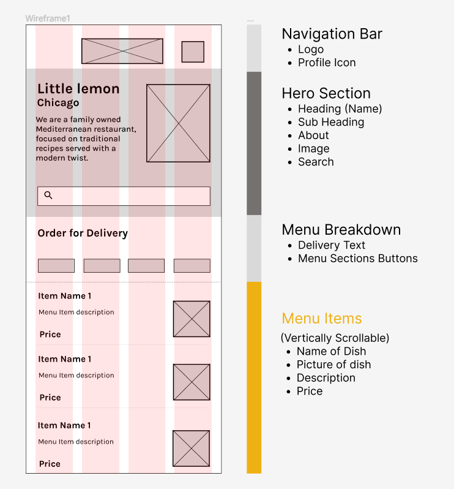
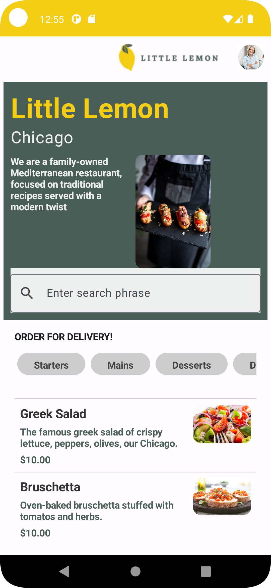

# Little Lemon Android App

This is Meta Android Developer final capstone project.

## Wireframe/Screenshot/Output >>
|  |   |
| ------------ | ------------ |

## Useful Git Command >>
- `` git init ``
- `` git add . ``
- `` git commit -m "message" ``
- `` git push origin master ``
- `` git status ``
- `` git fetch ``
- `` git config --global user.email "youremail@example.com" ``
- `` git remote add origin url.git ``
- `` git pull origin master ``
- `` git --version ``
- `` git remote -v ``